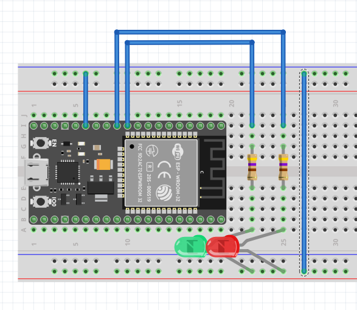
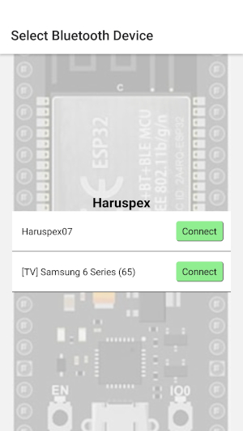
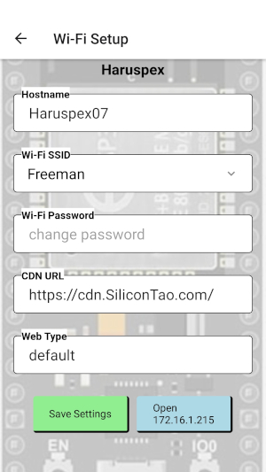

# Haruspex
A web server built on the ESP32 platform. It uses a React-Native app for Android to setup the Wi-Fi credentials and it serves the web frontend from an external CDN to save space in the microcontroller.

First commit was a rudimentary web server as taken from the example [ESP32 Web Server](https://randomnerdtutorials.com/esp32-web-server-arduino-ide/)
with some small changes. Code was changed to not block requests from other clients so that multiple connections can be made.

This is my first Bluetooth project with the ESP32 but it was having a lot of problems communication with the React-Native app. To isolate the problems the [BletiaCS](https://gitlab.com/SiliconTao-Embedded/BletiaCS) project was created to test Bluetooth communications between a client and a server that are both ESP32 devices.

<!-- vscode-markdown-toc -->
* 1. [Development](#Development)
	* 1.1. [VS Codium](#VSCodium)
	* 1.2. [Hardware](#Hardware)
* 2. [configApp](#configApp)
* 3. [Android Debug Bridge (adb)](#AndroidDebugBridgeadb)
* 4. [Running In AVD](#RunningInAVD)
* 5. [Wifi Credentials](#WifiCredentials)
* 6. [The Data Partition](#TheDataPartition)
* 7. [Frontend CDN](#FrontendCDN)
* 8. [Web Type](#WebType)
* 9. [Useful Links](#UsefulLinks)

<!-- vscode-markdown-toc-config
	numbering=true
	autoSave=true
	/vscode-markdown-toc-config -->
<!-- /vscode-markdown-toc -->


##  1. <a name='Development'></a>Development
###  1.1. <a name='VSCodium'></a>VS Codium
The development of this project is done with VSCodium and the PlatformIO extension.

VSCodium is not supported by Microsoft and so these plugins must be manually installed.
1. Download [cpptools-linux.vsix](https://github.com/microsoft/vscode-cpptools/releases/download/1.3.1/cpptools-linux.vsix)
2. Install cpptools-linux.vsix in vscodium under extensions / install from vsix
3. Download [PlatformIO vsix](https://marketplace.visualstudio.com/items?itemName=platformio.platformio-ide) (download button on right side)
4. Install PlatformIO vsix in vscodium under extensions / install from vsix

###  1.2. <a name='Hardware'></a>Hardware
I used [Fritzing](https://fritzing.org/) to create a circuit board layout.



EPS32 part for Fritzing can be found here [ESP32S-HiLetgo Dev Board with Pinout Template](https://forum.fritzing.org/t/esp32s-hiletgo-dev-boad-with-pinout-template/5357?u=steelgoose)


```bash
# esptool flash_id
esptool.py v2.8
Found 1 serial ports
Serial port /dev/ttyUSB0
Connecting....
Detecting chip type... ESP32
Chip is ESP32D0WDQ5 (revision 3)
Features: WiFi, BT, Dual Core, 240MHz, VRef calibration in efuse, Coding Scheme None
Crystal is 40MHz
MAC: 08:d1:f9:e6:b1:68
Enabling default SPI flash mode...
Manufacturer: 5e
Device: 4016
Detected flash size: 4MB
Hard resetting via RTS pin...
```

##  2. <a name='configApp'></a>configApp
An Android app developed using React-Native Expo

First attempt to use Bluetooth was with [react-native-ble-manager](https://www.npmjs.com/package/react-native-ble-manager) which seems like a great choice with support for Android 4 and newer APIs.
Unfortunately it does not seem to be compatible with Expo because it requires setting [AndroidManifest](https://github.com/innoveit/react-native-ble-manager/blob/master/example/plugins/withBLEAndroidManifest.js) that is not supported by Expo, or at least not in this way.

Expo has a different module [react-native-ble-plx](https://expo.dev/blog/how-to-build-a-bluetooth-low-energy-powered-expo-app)

Big thanks to the developers of [Punch Through LightBlue](https://punchthrough.com/lightblue/) app. It made debugging BLE issues much easier.


[Expo Go](https://expo.dev/go) does not support using the Bluetooth hardware but is great for quickly testing screen layout and desgines, it will automatically update with changes live.

Installing packages uses ``npx expo install <package name>``.

Uninstalling packages uses ``npm uninstall <package name>``.

Originally tried using ``react-native-ble-manager`` but could not get it to work.

```bash
npm uninstall react-native-ble-manager
npx expo install react-native-ble-plx
```

Installing VSCode plugins:
 - Expo Tools

Installing Android Studio
```bash
brew install --cask android-platform-tools
rehash
adb device
```

```bash
#npx npm install eas-cli
npm install --global eas-cli
npx expo prebuild
npx expo install expo-dev-client
npx expo run:android
```

To build the APK use [eas-cli](https://www.npmjs.com/package/eas-cli)

Set the Android SDK path and environment variable in the shell profile. These values are specific to my environment. You will need to adjust them to match your environment.
```bash
export ANDROID_HOME=$HOME/Library/Android/sdk
export PATH=$PATH:$ANDROID_HOME/platform-tools
export PATH=$PATH:$ANDROID_HOME/tools
export PATH=$PATH:$ANDROID_HOME/tools/bin
export PATH=$PATH:$ANDROID_HOME/emulator
export JAVA_HOME=/Library/Java/JavaVirtualMachines/amazon-corretto-21.jdk/Contents/Home
```

Once you have setup your Java environment variables compile the DEV version of the code like so.
```bash
cd configApp
npm install
npm run dev_build # Builds HaruspexDev.apk to debug with Expo Metro
npm run release_build # Build Haruspex.apk as standalone app
```

If you are not able to compile the APK, this prebuilt one is available.
[Haruspex.apk](https://cdn.SiliconTao.com/Haruspex.apk)
Validate the file with MD5SUM [Haruspex.md5](https://cdn.SiliconTao.com/Haruspex.md5).
```bash
md5sum -c Haruspex.md5
```


Connect the Android phone via USB and upload using either of these
```bash
npm run upload # To install HaruspexDev.apk
npm run release # To install Haruspex.apk

# or
adb install Haruspex.apk
```

To run the DEV version, Metro must be running on the dev computer inside the ``configApp`` directory.
```bash
npx expo start
```

 

##  3. <a name='AndroidDebugBridgeadb'></a>Android Debug Bridge (adb)
ADB requires that the phone be in developer mode and that ``USB Debugging`` be enabled in `Settings` -> `Developer Options`.

ADB is a command line tool that can be used for file management of the Android device.

List files in Screenshots folder
```
adb shell ls -R "/storage/self/primary/DCIM//Screenshots/"
```

Download a screenshot
```
adb pull /storage/self/primary/DCIM//Screenshots/Screenshot_20241112-092414_Haruspex.jpg ~/Screenshot_20241112-092414_Haruspex.jpg
/storage/self/primary/DCIM//Screenshots/Screenshot_20241112-092414_Ha...pex.jpg: 1 file pulled, 0 skipped. 13.0 MB/s (191856 bytes in 0.014s)
```

##  4. <a name='RunningInAVD'></a>Running In AVD
AVD does not support BLE hardware but can be used for designing the screen layout.

Android Virtual Device must be setup in Android Studio before running in this way.

```bash
npx expo run:android
```

##  5. <a name='WifiCredentials'></a>Wifi Credentials
Connect to the ESP32 using the Haruspex BLE app for Android and set Wi-Fi credentials.

This version of the project no longer supports a ``secrets.txt`` file.

# Partitions
Adding Bluetooth libraries made the binary 1.5MB and was to large for the default 1.3MB app partition.

A custom partition was made to remove OTA partitions and increase the app partition size.

> **_NOTE:_** [Offset must be multiple of 4kB (0x1000) and for app partitions it must be aligned by 64kB (0x10000).](https://developer.espressif.com/blog/how-to-use-custom-partition-tables-on-esp32/)

##  6. <a name='TheDataPartition'></a>The Data Partition
The data partition is used to store files that are not compiled code.

The ``./data`` directory must be built as a Filesystem Image in PlatformIO and uploaded to the ESP32.

The LibreOffice Calc file is configured to calculate the partition sizes and offsets. It uses a function to convert HEX2DEC, perform the calculations and convert back to HEX with a prefix ``0x``

```
=CONCAT("0x", DEC2HEX(HEX2DEC(RIGHT(D3, LEN(D3)-2))+HEX2DEC(RIGHT(E3, LEN(E3)-2))))
```

##  7. <a name="FrontendCDN"></a> Frontend CDN
The frontend files are served from a CDN (Content Delivery Network).
To do this ``Access-Control-Allow-Origin`` is set in the header served by [webServer.cpp](./src/webServer.cpp)
and in the CDN.

For development the frontend can be served locally using [webServer.py](./frontend/webServer.py) that has CORS enabled.

##  8. <a name="WebType"></a> Web Type
The Web Type is a configuration value that selects the front end web pages to load.

Available Web Types:
 * haruspex loads [haruspex.js](./frontend/haruspex.js)
 * leds loads [leds.js](./frontend/leds.js)


##  9. <a name='UsefulLinks'></a>Useful Links
- [ESP32 Dev Kit Power Options](https://techexplorations.com/guides/esp32/begin/power/)
- [Amazon ESP32 Dev](https://www.amazon.ca/gp/product/B07QCP2451/ref=ppx_yo_dt_b_search_asin_title?ie=UTF8&th=1)
- [ESP32-WROOM Datasheet](https://www.espressif.com/sites/default/files/documentation/esp32-wroom-32_datasheet_en.pdf)
- [FCC Report for 2A4RQ-ESP32](https://fcc.report/FCC-ID/2A4RQ-ESP32)
- [ESP32 Partition Tables](https://docs.espressif.com/projects/esp-idf/en/stable/esp32/api-guides/partition-tables.html)
- [ESP32 Partition Calculator](https://esp32.jgarrettcorbin.com/)
- [react-native-ble-plx-demo](https://github.com/priyanka-Sadh/react-native-ble-plx-demo)
- [Example of Expo with react-native-ble-pl](https://blog.theodo.com/2023/07/ble-integration-for-rn-apps/)
- [Bluetooth ESP32](https://dronebotworkshop.com/esp32-bluetooth/)